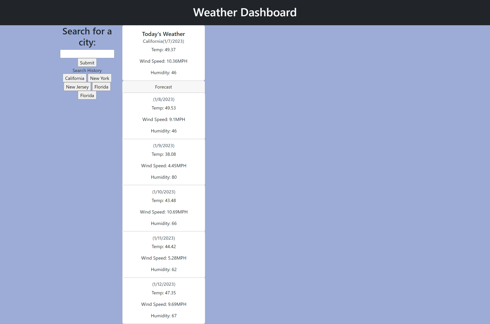

# Title
Weather Tracker

# Table of Contents
[Description](#description)

[Installation](#instalation)

[Usage](#usage)

[Screenshots](#screenshots)

[GitHub Page](#github-page)

[Contributors](#contributors)

[Questions](#questions)

## Description
A simple website that displays today's weather and provides forecast for the next couple days

## Installation
Clone the repo and run the index.html file via browser

## Usage
Useful for viewing current weather and look at forecasts, also able to store search history for easier and quick access

## Screenshots

## GitHub Page
https://mkhlink.github.io/Weather_Tracker/

## Contribution
Mohammad Komol Hasan

## Questions
GitHub: MKHLink

Email: likhonhasankomol@gmail.com
    
